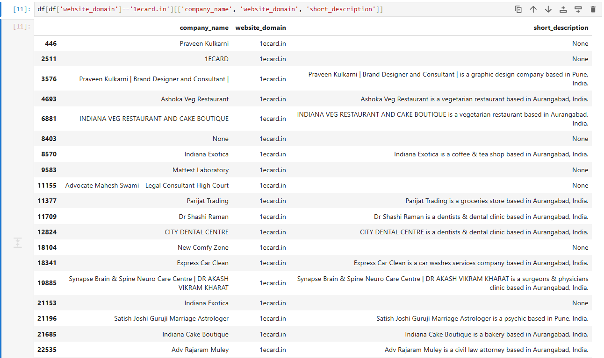
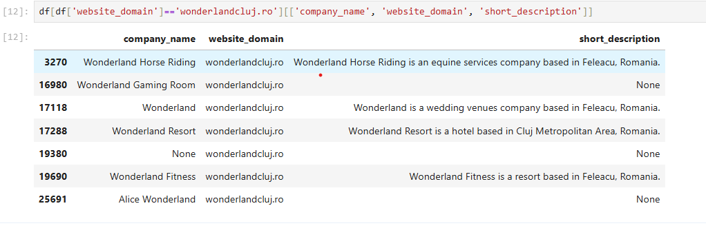
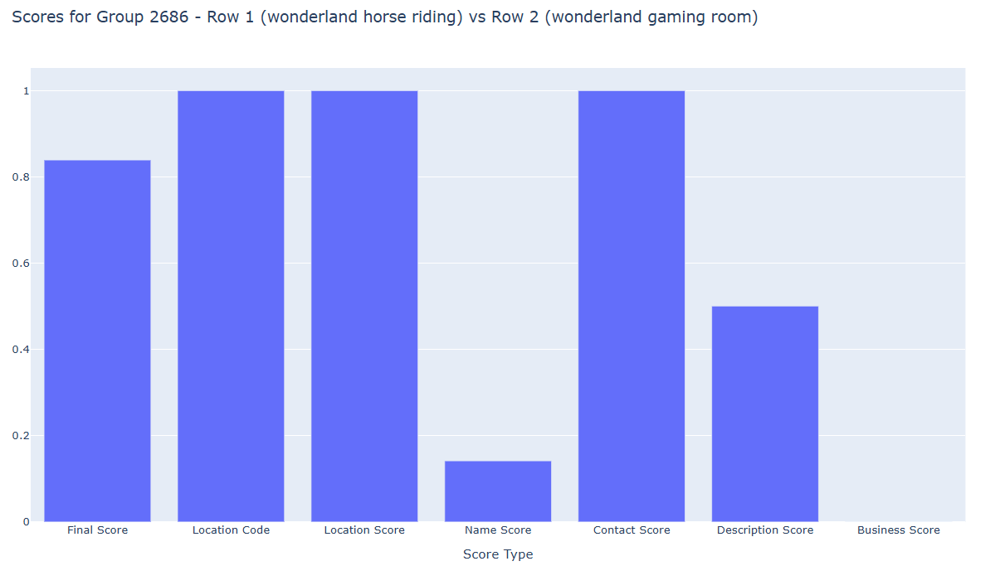

# Challenge 3 - Entity Resolution

### Task
Identify unique companies and group duplicate records accordingly.

### Context

The dataset contains company records imported from multiple systems, leading to duplicate entries with slight variations.

### Guidelines

- The dataset includes extensive company details, but not all fields are necessary for deduplication.
- The key challenge is to identify and leverage the most relevant attributes to accurately detect and group duplicate records.
- Take the time to research and understand what defines a company and which attributes uniquely identify it. This understanding is crucial for accurately detecting and grouping duplicate records.
At times, incomplete data may require you to make decisions where there is no clear right or wrong choice. 

### Output

Return the updated dataset where you have correctly identified unique companies and grouped duplicate records accordingly.

# Before words

Before I dive deep in my solution I would like to clear some things about how I see 'unique' companies.

### My definition on unique companies

In the dataset, there are companies which may come from the same franchise, but in different places, that is
why in my solution I consider companies as legal entities, meaning if KFC has 40 restaurants in Romania, those 40 restaurants are unique companie, since they are different legal entities.

### Another important thing

The description of the challenge strictly implies grouping duplicates together so I won't do anything reargding merging duplicates together.

# Initial thoughts

I am not going to lie, I may have tried to run an hashing algorithm and of course I found 5 total matches, 
I may have :))

After becoming clear that this is a more complex task than it may seem, I decided to do a deep exploration of the dataset, this started with understanding each column and the possible values a column can have.

Initally I hoped to be able to find meaning in the values so I can create an algorithm that runs on the whole dataset and groups together duplicate companies. However after some exploration I found out that the data isn't predictable at all, meaning we can have discrepencies between names, domains, locations, description.

Afterwards, I decided that most likely companies that have the same domain represent the same company, so afterwards I traversed companies that have the same **domain** and I found out a very intersting case which made me realise that the problem gets even more complicated.

### The ecards phenomen 

This business basically makes business digital cards for companies, so I was getting multiple companies from the **1ecards.in** domain that were totally differnt.



### The Cluj wonderland phenomen 

After finding out about what I mentioned above, I was like, okay if they come from the same domain and have the same location it means for sure that they are the same company, well, of course I proved me wrong again, when I found that Wonderland Cluj has multiple companies, with the same domain, one near each other.

For example: Wonderland Horse Riding, Wonderland kindergarden, Wonderland resort etc



### The too much data phenomen

While trying to divise a plan I would get lost through the big volume of data, most of the time data that wouldn't count so much.

# Time for cleaning the dataset

Ok, so now I need to get done to business, there are many unknown variables, but to be able to understand they key fields I need to **clear** out the noise.

Therefore, below I will argument each column dropped from the dataset.

#### 1. Statistics, national, economics codes 

- 'sics_codified_industry'
- 'sics_codified_industry_code'
- 'sics_codified_subsector'
- 'sics_codified_subsector_code'
- 'sics_codified_sector'
- 'sics_codified_sector_code'
- 'naics_2022_primary_label'
- 'naics_2022_secondary_codes'
- 'naics_2022_secondary_labels'
- 'naics_vertical'
- 'isic_v4_labels'
- 'sic_labels'
- 'sic_codes'
- 'naics_2022_primary_code'
- 'isic_v4_codes'
- 'nace_rev2_labels'
- 'nace_rev2_codes'


**FYI, you can skip this short description of this codes**

- SICS (**Sustainability Industry Classification System**): It has largely been phased out in favor of more standardized systems like NAICS.

- NAICS (**North American Industry Classification System**): Widely used in North America to classify businesses into industries.

- ISIC (**International Standard Industrial Classification**): A global system for classifying economic activities, commonly used for international comparisons.

- SIC (**Standard Industrial Classification**): An older system, mostly replaced by NAICS, but still referenced in some contexts.

- NACE (**Nomenclature of Economic Activities**): The European counterpart to NAICS and ISIC
  
**End of short description of codes**

Basically, this are indicators, simillary to CAEN codes in Romania, to identify the domain in which the company activates, but as I found out, besides the fact thay they are in different regions, **SICS** was replaced by **NAICS**, only used in older contexts. 

It becomes clear that handling these columns requires deeper understanding of them, possibly searching for discrapencies between the codes that actually exist (there are errors in the code, for example I found multiple companies representing a single entity with different latitude and longitude coordinates, that leads me to believe that clearly everything in the dataset could have a little noise), not to mention that we don't have that many non-null values.

```
 25  naics_2022_primary_code       18048 non-null  object
 26  naics_2022_primary_label      18048 non-null  object
 27  naics_2022_secondary_codes    244 non-null    object
 28  naics_2022_secondary_labels   244 non-null    object
 50  sics_codified_industry        5661 non-null   object
 51  sics_codified_industry_code   5661 non-null   object
 52  sics_codified_subsector       5661 non-null   object
 53  sics_codified_subsector_code  5661 non-null   object
 54  sics_codified_sector          5661 non-null   object
 55  sics_codified_sector_code     5661 non-null   object
 56  sic_codes                     18048 non-null  object
 57  sic_labels                    18048 non-null  object
 58  isic_v4_codes                 18048 non-null  object
 59  isic_v4_labels                18048 non-null  object
 60  nace_rev2_codes               18048 non-null  object
```

Conclusion, the time and effort I should put into those codes is a waste of my resources given the task and the deadline, when I can focus on understanding more important fields.

#### 2. Time related columns

- 'year_founded'
- 'lnk_year_founded'
- 'created_at'
- 'last_updated_at'

Not really relevant to my problem, the year a company was founded is not really relevant in my case because, besided those values can be wrong, it also isn't something that can identify a unique company.

'last_updated_at' not really helps me in this situation because I am not interested in merging the information together, also since my job is to group duplicates together if there is a row with outdated company information and one with updated information it still makes the outdated one a duplicate, same with 'created_at'.

#### 3. Website metadata

- 'website_number_of_pages'
- 'website_tld'
- 'inbound_links_count'
- 'all_domains'
- 'website_language_code'

I decided to discard this metadata about the website were the company was scraped from because it provides little to none inside into the strucutre of the company.

Firstly, 'website_number_of_pages' is something related to nothing of intereset currently, because it has no directly connection to the company, same for 'ibound_links_count' cause I am not able to find out which sites point to the current company's site.

Regarding, 'website_tld', that one can just be obtain from the 'website_domain' field, so no need for this. 
'all_domains' is equal to 'domains' so I can delete this one from the start.
'website_language_code' could matter if I would be using an embedding model specific for each language, but in my case my embedding model can handle multiple languages.

#### 4. Empty fields

- 'tiktok_url',
- 'alexa_rank',
  
```
48  tiktok_url                    0 non-null      object
49  alexa_rank                    0 non-null      object
```

Self explanatory.

#### 5. Other fields

- 'status' => all rows are active
- 'main_country' => I use main_country_code, no need for this as well 
- 'num_locations' => I don't consider I should use this, since I know there are duplicates and this would mean that I don't know exaclty which are which, therefore the field can confuse my algortih,
- 'company_type' => public or private, 11 rows of private, 19000 rows of public, not that much information
- 'revenue' => if numbers have the possibility of being incorrect, or almost incorrect than this field could also have faulty values, so I don't want to count on it
- 'revenue_type' => modelled or extracted, too little information
- 'employee_count' => not relevant, and again could be faulty
- 'employee_count_type' => modelled or extracted, too little information


# Solution description

Now that the dataset is cleaned, I can focus only on the relevant features. Currently this are the columns I am going to use to classify companies as duplicates.

```
#   Column                    Non-Null Count  Dtype 
---  ------                    --------------  ----- 
 0   company_name              32617 non-null  object
 1   company_legal_names       6890 non-null   object
 2   company_commercial_names  28121 non-null  object
 3   main_country_code         31415 non-null  object
 4   main_region               30112 non-null  object
 5   main_city_district        5979 non-null   object
 6   main_city                 29602 non-null  object
 7   main_postcode             23822 non-null  object
 8   main_street               19980 non-null  object
 9   main_street_number        17039 non-null  object
 10  main_latitude             30664 non-null  object
 11  main_longitude            30668 non-null  object
 12  main_address_raw_text     27980 non-null  object
 13  locations                 31415 non-null  object
 14  short_description         18702 non-null  object
 15  long_description          11731 non-null  object
 16  business_tags             9249 non-null   object
 17  product_type              19798 non-null  object
 18  main_industry             19798 non-null  object
 19  main_sector               19798 non-null  object
 20  primary_phone             22799 non-null  object
 21  phone_numbers             22799 non-null  object
 22  primary_email             6508 non-null   object
 23  emails                    3316 non-null   object
 24  other_emails              578 non-null    object
 25  website_url               31893 non-null  object
 26  website_domain            31893 non-null  object
 27  website_language_code     6104 non-null   object
 28  facebook_url              11282 non-null  object
 29  twitter_url               2755 non-null   object
 30  instagram_url             7014 non-null   object
 31  linkedin_url              10200 non-null  object
 32  ios_app_url               123 non-null    object
 33  android_app_url           138 non-null    object
 34  youtube_url               1142 non-null   object
 35  generated_description     19468 non-null  object
 36  generated_business_tags   19445 non-null  object
 37  domains                   11592 non-null  object
 38  id                        33446 non-null  int64 
```

Initially, I wanted to do something that could be done by simple algorithms without more complex problems.

However I spent some time in traversing the dataset and I found that the data cannot and is not that reliable always (e.g. wonderland case, ecards).

I would also like to present another interesting case, the Autoland Toyota case where the site had a link to schedule an appointment and it was considered as a different row, Autoland Toyota Service.

I also wanted to make something relatively efficient, and if I created an algorithm that calculates some kind of similarity score between each row compared to each row it will take too much time.

So, we should ask, when are two companies duplicates, well when they have the same charactersitics, but can we group them in a way that we know that the companies grouped together are more likely to be duplicates to each other. 

Well, yes, when companies are coming from the same data source, it means that they could be duplicates. Companies usually have a common domain, or a common social media page for multiple companies at different locations.

Exp: https://kfc.ro/restaurante/cluj-napoca/kfc-cluj-napoca-centru (yes I keep giving KFC as an example, because I was hungry at the time of writing this)

So if I succeed in grouping them together it means that all is left is to create the simillarity detection algorithm.

First things first, how do I group them together? Short story, If 2 rows point to the same domain, linkedin page, instagram page, facebook page etc. I will put them in the same group.

Of course there is also the case:

C1 -> fakedomain.com
C2 -> linkedin/fakepage
C3 -> fakedomain.com, linkedin/fakepage

So I need to make sure I cover this cases as well that can appear in this situations.
For this I have wrote 2 scripts: **group.py** and **group_by.py**

1. **group.py**

Defines the class that represent a group, more specifically:

```
import pandas as pd

class DataGroup:

    def __init__(self, group_no):
        self.group_no = group_no
        self.domain = set()
        self.facebook_url = set()
        self.twitter_url = set()
        self.instagram_url = set()
        self.linkedin_url = set()
        self.youtube_url = set()
        self.android_app_url = set()
        self.ios_app_url = set()
        # keeps a record of all rows associated to this group
        self.row_indexes = set()

    # makes the union of 2 groups
    def union(self, group: "DataGroup"):

    # ads a row to the group and its corresponding uri's
    def add_row(self, row):

    # if this is called, it means that we need to reroute using the dictionaries received the URIs that # point to this DataGroup.
    def reroute_uris(self, reroute_to_group, domain_dict, facebook_url_dict, twitter_url_dict, instagram_url_dict,
                     linkedin_url_dict, youtube_url_dict, android_app_dict, ios_app_dict):


    def __str__(self):
```

As you can see it is made of sets, and each one of those sets hold the specific data source identifiers(domains, urls) that make that group.

2. **group_by.py**

For your information, this are the data source identifiers:
```
uri_types = ['website_domain', 'facebook_url', 'twitter_url', 'instagram_url', 'linkedin_url', 'youtube_url','android_app_url', 'ios_app_url', 'domains']
```

In this file the routing and rerouting of all the rows is made, until we have a nice list of DataGroups.

Another important thing is that I run an experiment, the most **expensive** operation in this grouping is the **DataGroup.reroute_uris**, because is called when we find that 2 types of groups have common uri_types, however for 33000 rows, the reroute function was called approximately 700 times, which is not bad at all!

## Yey, we have the rows grouped together, now what?

Now the part that is most complicated, how do I detect if companies are duplciates.

Before I start explaining, remember I have grouped the companies that could possibly be duplicates, so my chain of taught was based on this, because things are a little different and from the huge list of unknow variables.

When could 2 companies be duplicated.

1. When they have the same location 

I built a function in **location.py**, more specifically:

```
location_similarity_code()
```

This function, calculates the distance in meters based on langitude and latitude, if both of those are present in the current row.

If this is not possible, we check if the fields that represent attributes of a location are equal. However the fields may not be exactly equal.

That is why I decided to use an embedding model to embed the location string and then calculate the cosine similarity. Honestly I went with this approach because I found about this while looking at vector databases and it is something that I can visualise. I know I cnanot visualise in a more than a 3 dimensional space, but at least like this I can what is going on.

After this I calculate the final score:

```
final_score = (geodesic_score + location_similarity + location_sim_mean) / 3

return final_score
```

However, if we look at the Wonderland business we find out that there are 5 different business one in proximity to each other so there needs to be other measurements taken in place by me.

You can see this example, is from my first solution, for now you can ignore the other scores, but as you can see differnt companies, same location,, high location score.



2. When they have the same name

It wouldn't be uncommon for 2 totally different companies have different names, but remeber I already grouped them in a way so this would be a big indicator.

Here I use 2 methods, in **score.py**.

I have this function:
```
def name_similarity_score(row1, row2):
    names1 = set()
    names2 = set()

    for col in ['company_name', 'company_legal_names', 'company_commercial_names']:
        if pd.notna(row1[col]):
            names1.update(name.strip() for name in row1[col].split('|'))
        if pd.notna(row2[col]):
            names2.update(name.strip() for name in row2[col].split('|'))

    if not names1 and not names2:
        return 0.0

    exact_match_score = len(names1.intersection(names2)) / (len(names1.union(names2)))
    text_similarity_score = 0.0
    for name1 in names1:
        for name2 in names2:
            text_similarity_score = max(text_similarity_score, get_text_similarity(name1, name2))

    combined_score = (exact_match_score * 0.6 + text_similarity_score * 0.4)
    return combined_score
```

As you can see I first check if there are some exact matches between those two rows, afterwards I check using the embedding model the cosine similarity between those two.

Afterwards I return a weighted arithmetic mean, and the weights are set by me, through experimenting and also through logic, because if I have exact matches they should matter more.

3. When they have the same contacts, emails, phone numbers etc.
   
4. When they have the same description

5. When they are from the same bussiness, industry, domain etc.

```
def similarity_score(row1, row2):
    location_score = location_similarity_code(row1, row2)
    name_score = name_similarity_score(row1, row2)
    contact_score = contact_similarity_score(row1, row2)
    description_score = description_similarity_score(row1, row2)
    business_score = business_similarity_score(row1, row2)

    if location_score == 0.0:
        location_score = 1.0

    final_score = location_score*0.3 + name_score*0.2 + contact_score*0.3 + description_score*0.1 + business_score*0.1

    return final_score
```

**3, 4, 5** work on the same logic as the ones described above.

The weights were set by using logic, power of deduction and experimenting :)).

You can find the bar graphs for certain solution numbers in ./assets/solution_{no}, but I didn't exactly mark the wieghts used for each solution so you can skip that.

# Conclusion

1. Clean the dataset
2. Group companies together based on the resource they are coming from (domains, linkedin URLs etc)
3. Process each group
4. Score the simillarity of postition, description, business type, name, between every 2 rows in the group
5. Save the solution

# Afterword

I enjoyed the challenge very much, it was interesting and required some solutions that made me think out of the box.

I hope you were able to follow everything and I am sorry for any grammatical mistakes, if any!

Even if your decision is not to proceed with my application I would really like some feedback on my solution, I spent some time on it.

The company sounds really nice and you seem dedicated and if this year is not the year for, expect another application from me next year!

Raul Spatariu